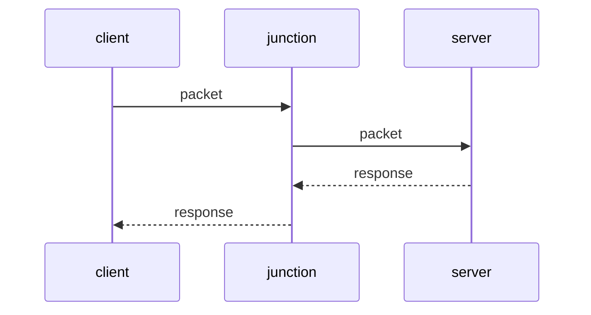

# Junction

a docker image from alpine linux using openssh to forward port to destination



## building image

generate a ssh-key then
create `.ssh` directory in the same directory as `DockerFile` and
place generated keys in this directory then build the image

> note: never publish image with your secret keys publicly

> note: you may want to set environments in DockerFile itself its your choice

```bash
docker build . -f Dockerfile -t junction
```

## running container

to force docker to restart until you stop it manually use args: `--restart unless-stopped`
this ensures container restart if stopped due to any issues caused by network

environments:
> LOCAL_PORT: the port used by container
>
> DESTINATION_PORT: port on server that packets will forward to
>
> DESTINATION_USER: user on destination server that ssh will connect to - do not use root user
>
> DESTINATION_ADDRESS: server ip ssh will connect to
>
> DESTINATION_SSH_PORT: ssh port on server - default: 22

```bash
docker run --restart unless-stopped --network host -e "LOCAL_PORT=80" -e "DESTINATION_PORT=1080" -e "DESTINATION_ADDRESS=<SERVER_IP>" -e "DESTINATION_USER=<e.g. forwarder>" -e "DESTINATION_SSH_PORT=<default:22>" -d junction
```
